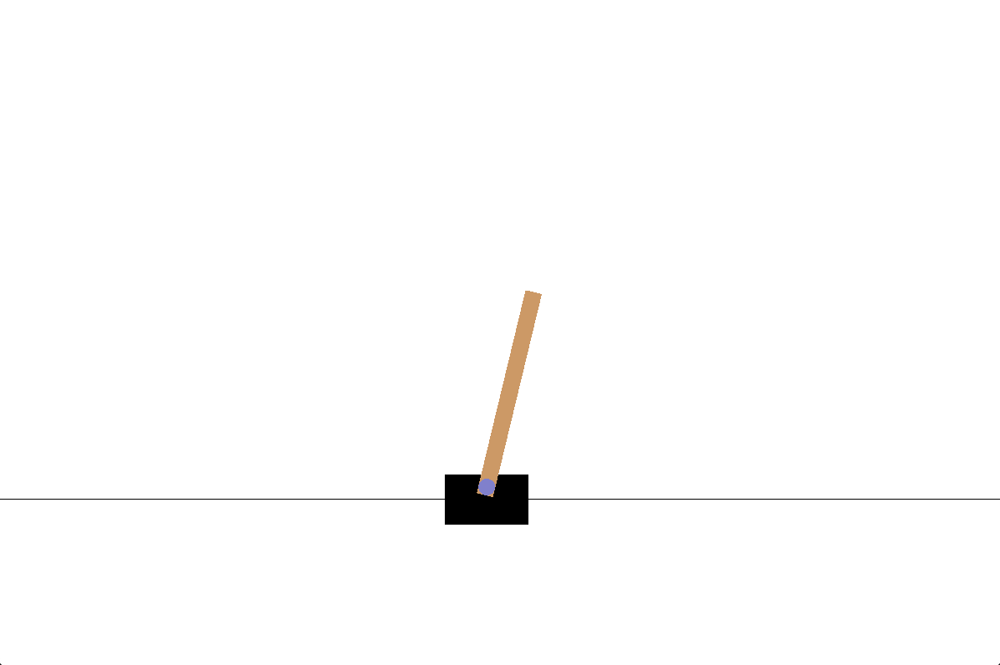
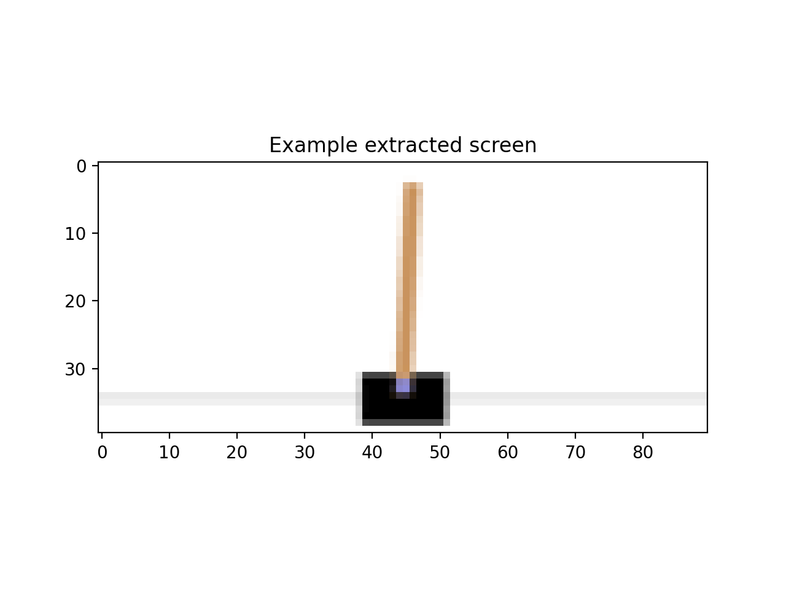
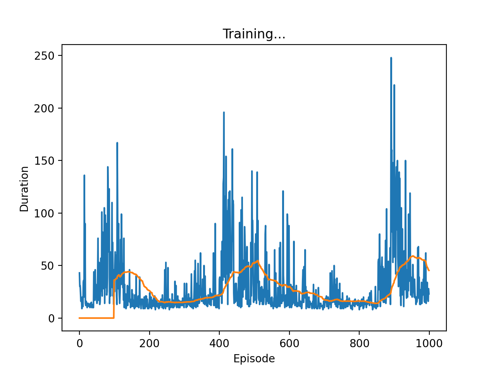

# PyTorch CartPole

I'm learning some PyTorch, this repo is just the result of the [PyTorch CartPole tutorial](https://pytorch.org/tutorials/intermediate/reinforcement_q_learning.html).

The cartpole problem involves learning how to balance a pole on a cart by moving the cart left or right. It's an [OpenAI gym](https://gym.openai.com/) environment.

This particular version takes the pixel data as input (rather than the position/velocity of the cart and pole), so it's only learning from what it sees.

Here's a sample run. Calculated with CPU on a laptop, and trained for well under an hour. I didn't bother with tweaking the hyperparameters, this whole exercise is just for me to get more familiar with how PyTorch works.

